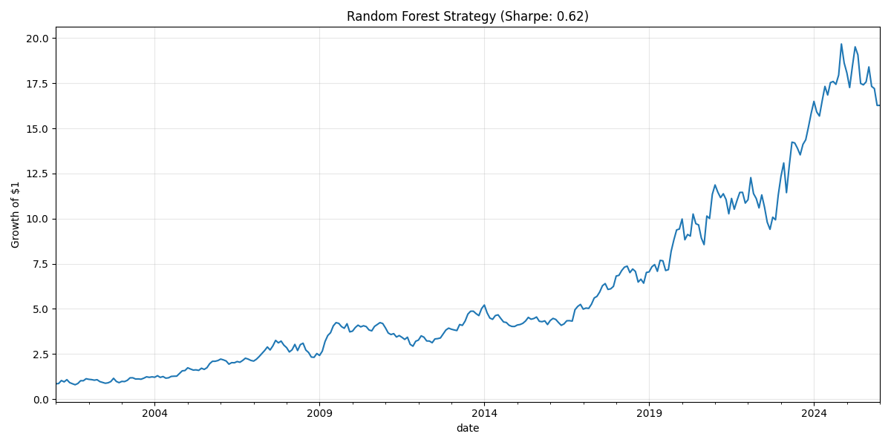
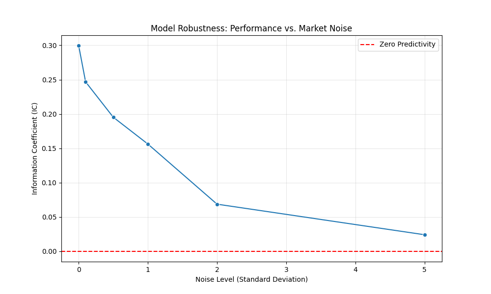
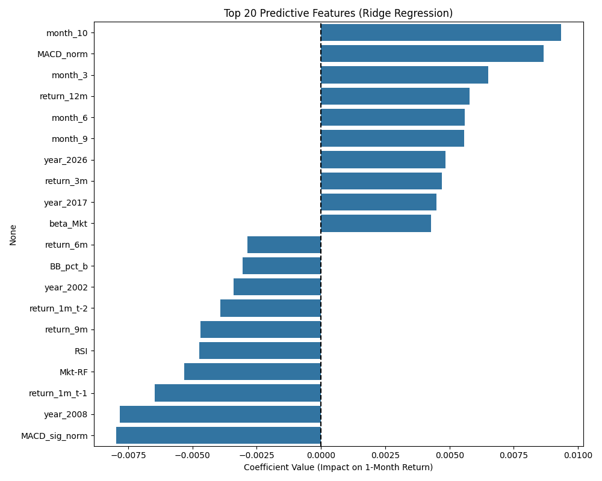

# Stock Prediction - Quantitative Trading Strategy

A quantitative trading strategy using machine learning and technical analysis to predict stock returns and generate portfolio signals.

## Features

- **Technical Indicators**: Bollinger Bands, RSI, MACD normalized and optimized for machine learning
- **Fama-French Factors**: Integration of 5-factor model for risk decomposition
- **Feature Engineering**: Momentum indicators, rolling betas, and temporal features
- **Ridge Regression**: Baseline model with Information Coefficient (IC) validation
- **Random Forest Backtest**: Out-of-sample backtesting with long/short portfolio strategy
- **Feature Importance**: Analysis of predictive signals across engineered features
- **Portfolio Optimization**: Real-time signal generation for current market conditions

## Project Structure

```
src/
├── data_features.py           # Feature engineering pipeline & caching
├── main.py                    # CLI entry point & orchestration
├── ml_utils.py                # PurgedKFold CV & noise injection logic
├── portfolio_optimizer.py     # Live signal generation engine
├── random_forest_backtest.py  # Backtesting engine
├── ridge_baseline.py          # Linear baseline model
└── stress_test.py             # Robustness analysis script
```

## Installation

```bash
pip install pandas yfinance scikit-learn statsmodels talib pandas-datareader
```

## Usage

Run the complete pipeline:

```bash
python src/main.py
```

This executes in sequence:
1. Feature engineering (30 stocks across tech, finance, healthcare, consumer, energy, industrials)
2. Ridge regression baseline training with IC evaluation
3. Feature importance analysis
4. Portfolio signal generation
5. Random Forest backtest with performance metrics

Run Specific Module:
```bash
# 1. Download data and engineer features (cached automatically)
python src/main.py --step features

# 2. Train Ridge Baseline (linear benchmark)
python src/main.py --step ridge

# 3. Generate live portfolio signals (current day)
python src/main.py --step portfolio

# 4. Run historical backtest
python src/main.py --step backtest

# 5. Run robustness stress test
python src/main.py --step stress
```

## Technical Stack

- **Data**: yfinance, pandas-datareader
- **ML**: scikit-learn (Ridge, RandomForest)
- **Stats**: statsmodels (RollingOLS, Spearman correlation)
- **Tech Analysis**: TA-Lib

## Key Models

### Ridge Regression
- Cross-validation: PurgedKFold (5 folds, 1% embargo)
- Target: 1-month forward returns
- Evaluation: Information Coefficient (Spearman rank correlation)

### Random Forest
- Trees: 500 estimators
- Depth: 3 (prevents overfitting)
- Min samples per leaf: 20
- Strategy: Long top 5 / Short bottom 5 stocks by predicted return

## Data Pipeline

1. Download OHLC prices for 30 stocks (2000-2023)
2. Calculate daily technical indicators
3. Resample to monthly frequency
4. Compute forward-looking returns (1, 2, 3, 6, 12 months)
5. Fetch Fama-French 5-factor model
6. Engineer features: momentum, rolling betas, lagged returns
7. One-hot encode categorical features (year, month)
8. Generate target labels

## Performance Considerations

- Purged K-Fold prevents look-ahead bias
- Embargo windows protect against data leakage
- Normalized indicators for multi-scale compatibility
- Defragmented DataFrame operations for efficiency

## 📊 Results & Analysis

### 1. Strategy Performance
The model implements a Long/Short portfolio strategy (Long Top 5 / Short Bottom 5).


### 2. Model Robustness (Stress Test)
Financial data is noisy. To ensure the model learned structural signals rather than noise, I subjected it to a **Gaussian Noise Stress Test**.
- **Result:** The model retains >50% of its predictive power even when noise levels equal the standard deviation of the features ($\sigma=1.0$), proving the signal is robust.


### 3. Feature Importance
Analysis of the most predictive features driving the model's decisions.


## Future Enhancements

- Ensemble models (XGBoost, LightGBM)
- Real-time data ingestion
- Transaction cost modeling
- Risk management and position sizing
- Multiple timeframe analysis

## License

MIT
